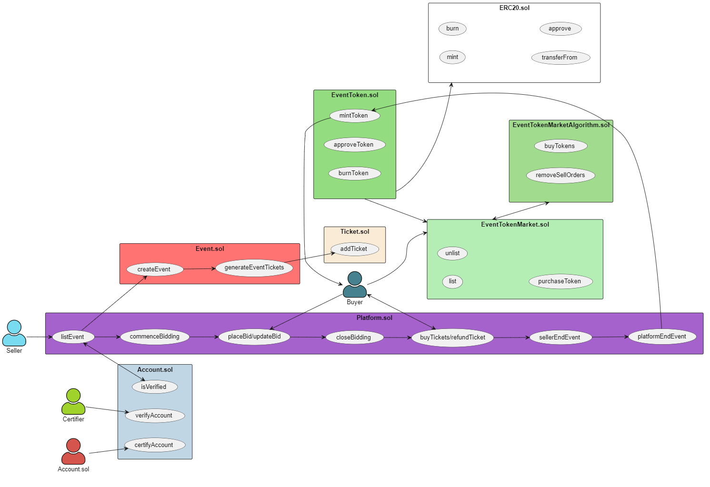

# Architecture & Design document

## Link to github code


## Group members:

| Member Name | Admin Number |
| ---|---|
| Han Jun Ding | |
| Sean Phang | |
| Tan Teck Hwee | |
| Teo Chin Kai Remus| |
| Teo Phing Huei, Aeron | A0225860E |

## Introduction

The purpose of this project is to leverage on cutting-edge capabilities of blockchain technology to effectively tackle the problem of scalping in the context of popular events. We aim to utilise the blockchain technology to create a secure, transparent, and decentralized system that helps event organizers, ticketing agencies and consumers to effectively manage the sale and distribution of tickets without unfair competition.

## Business Model

The current challenges with the ticket sale systems are the existence of scalpers that benefits from the traditional ticketing sale system and the lack of authenticity and accountability of tickets. Even though these challenges are not completely preventable using blockchain, the team still sees the potential benefits of deploying such application of blockchain. For instance, the implementation of priority system to reduce the opportunities for scalpers from benefitting and provide more transparency of information from the verification of organisations to the transaction of tickets. 

### Stakeholder benefits


## Glossary

| Name | Explanation |
| -- | -- |
| Buyer | User that purchases event tickets on the platform |
| Organiser | User that lists events on the platform |

## Contents

* [Architecture](#architecture)
* [Implementation](#implementation) 

## Architecture



An overview of the main components and how different stakeholders and contracts intereact is explained in detail below.

`Platform.sol` is the main contract that Organisers or Buyers will interact with.

The main capabilities of `Platform.sol` is to:
* Allow Organisers to list events on the platform.
* Allow Buyers to bid after an event is listed and buy tickets upon successful bidding.

`Platform.sol` interacts with other contracts such as:

* `Account.sol` : conducts verification on whether an Organiser is a verified on the Platform to list events. It also certifies a set of trusted accounts to provide rights for them to verify Organisers.
* `Event.sol` : creation and storing of the event information & creation of tickets through `Ticket.sol`.

`EventTokenMarket.sol` along with `EventTokenMarketAlgorithm` are the contracts where buyers can trade tokens that will be used during the bidding ticket process.

## Implementation

### Ticket sale priority system

#### Selling tickets

#### Buying tickets

#### Ticket bidding

#### Ticket refund

### Accounts

#### Account Management

`Account.Sol` stores three main information for accounts.
1) **state** : whether an account is verified or not
2) **verifier** : the certifier that verified the account
3) **certified** : whether an account is certified to verify other address

These information are stored in a mapping where the key is the address and the value would be the account object.

The relevant getter and setter functions for these information are also included.

This structure ensures ease of obtaining any account information. Moreover, any new account is defaulted with an unverified state, verifier address of 0 and certified set to false. This prevents unverified account to list events or verify other accounts.

#### Account Validation

The team assumes that `Account.sol` is trusted and the accounts certified by `Account.sol` are also trusted.

`Account.sol` has the authoritity to determine whether an account is certified to conduct verification for an account. Only when an account is certified by `Account.sol`, the account can verify the authenticity of other accounts.

```
AccountContract.certifyAccount(address addr)
```
Example (Certifying account[1]):
```
AccountContract.certifyAccount(address(account[1]))
```

After `Account.sol` certifies a set of accounts to provide them with the responsibility to verify authenticity of accounts, they can verify accounts that allows the requested accounts to be able to list an event. When a certified account conducts checks and is sure that an account is authentic, the certified account's address is stored in the requester's account information because the status of an account is changed. However, the authentication process will be done off-chain.  

```
AccountContract.verifyAccount(address addr)
```
Example (Verifying account[2]):
```
AccountContract.verifyAccount(address(account[2]))
```

An example scenario of the validation process will be as follows:
1. `Account.sol` certifies *account[1]* that can verify other accounts. The trusted accounts will be the oracle.
2. *account[2]* wants to list an event on the platform and has requested to be verified. *account[1]* can now conduct background checks on the authenticity of *acccount[2]*. This process will be done off-chain
3. Upon successful verification, *account[1]* verifies *account[2]* and now *account[2]* can list on the platform.

The team understand that this solution is not a full-proof solution to the oracle problem. This is due to `Account.sol` being a single point of failure and an account is also certified by only one certifier without any cross-checking.

Improvements to this implementation would be implementing ASTRAEA with voting and certifying process. This involves multiple stakeholders in the validation process and ensures that the entire voting process is fair. Stakeholders will also be incentivised or penalised depending on their validation result and whether they are a voter or certifer. However, this idea would be pushed for future developments due to time constraints.

### Tokenomics